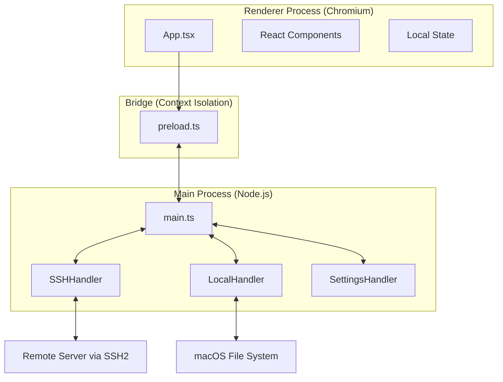

# System Architecture Document

This document describes the high-level architecture of MacSCP, a native macOS SCP/SSH client built with Electron, React, and TypeScript.

## High-Level Overview

MacSCP follows the standard Electron architecture, separating the application into two main processes: the **Main Process** and the **Renderer Process**.

## Key Components

### 1. Main Process (`electron/main.ts`)
The entry point of the application. It creates the BrowserWindow and sets up IPC (Inter-Process Communication) handlers for system-level operations.

### 2. Preload Script (`electron/preload.ts`)
Acts as a secure bridge between the Renderer and Main processes. It exposes a limited `window.api` object to the Renderer process using `contextBridge`, ensuring security by keeping Node.js APIs out of the Renderer.

### 3. SSH Handler (`electron/handlers/ssh.ts`)
Manages SSH and SFTP connections using the `ssh2` library. It handles:
- Connection and authentication.
- File listing (remote).
- File transfers (upload/download) including recursive directory transfers.
- Remote file reading/writing (editing).
- Terminal/Shell spawning and data streaming.

### 4. Local Handler (`electron/handlers/local.ts`)
Handles interactions with the local macOS file system, such as listing directories and managing file paths.

### 5. Settings Handler (`electron/handlers/settings.ts`)
Manages application settings, including theme preferences and window state, persisting them to the user's local application data directory.

### 6. React UI (`src/components/`)
- **`FileExplorer`**: The core UI component for the dual-pane file manager.
- **`ConnectionManager`**: Handles new connection inputs and authentication.
- **`SessionsView`**: Manages saved connection profiles.
- **`TerminalView`**: An integrated terminal using `xterm.js`.
- **`FileEditor`**: A simple integrated editor for editing remote files on the fly.

## Data Flow: File Transfer

1.  **Trigger**: User initiates a transfer (e.g., drag-and-drop or click "Transfer").
2.  **IPC Call**: The Renderer process calls `window.api.ssh.get` or `window.api.ssh.put`.
3.  **Main Process Action**: The Main process receives the request and instructs the `SSHHandler`.
4.  **SFTP Operation**: `SSHHandler` uses the `ssh2` SFTP client to stream the file data.
5.  **Completion**: Once the stream ends, the Main process notifies the Renderer (via a Promise resolution or IPC event), and the UI updates (e.g., refreshes file list).

## Security
- **Context Isolation**: Enabled to prevent malicious scripts in the Renderer from accessing Node.js APIs.
- **Sandboxing**: The Renderer process is sandboxed where possible.
- **IPC Validation**: All IPC calls are validated in the Main process before execution.
