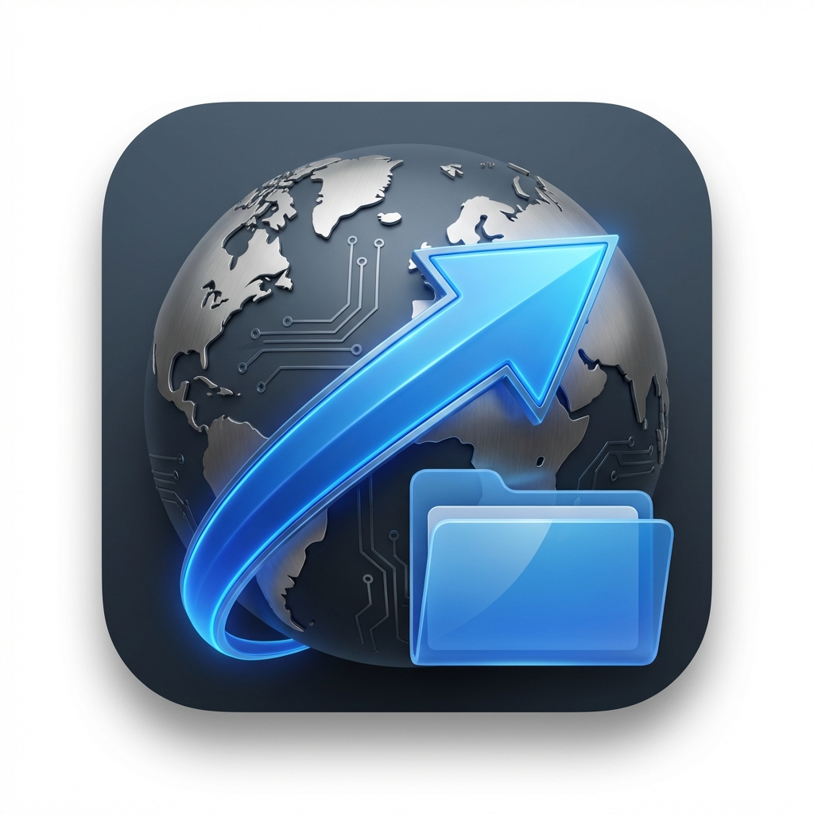

# MacSCP

A high-performance, native-feeling macOS SCP/SSH client built with Electron, React, and TypeScript. Dual-pane file management meets modern aesthetics.

 <!-- Placeholder for banner -->

## Features

- **Dual-Pane File Management**: Seamlessly browse local and remote file systems side-by-side.
- **Secure File Transfers**: Robust SFTP and SCP support for safe data movement.
- **Integrated Terminal**: Built-in shell access via `xterm.js` for quick command execution.
- **Remote File Editing**: Edit files directly on your server with an integrated editor.
- **Session Management**: Save and organize multiple connection profiles.
- **Native macOS Design**: Vibrant dark mode and glassmorphism effects for a premium feel.
- **Drag-and-Drop**: Easy file uploads and downloads.

## Tech Stack

- **Frontend**: React, Tailwind CSS, Lucide Icons, Sonner.
- **Backend**: Electron, Node.js, `ssh2`.
- **Developer Experience**: Vite, TypeScript, ESLint.

## Getting Started

### Prerequisites

- Node.js (v18 or higher)
- npm or yarn

### Installation

1.  **Clone the repository**:
    ```bash
    git clone https://github.com/tumishomaponya/macscp.git
    cd macscp
    ```

2.  **Install dependencies**:
    ```bash
    npm install
    ```

3.  **Start development mode**:
    ```bash
    npm run dev
    ```

### Building for Production

To create a production-ready application bundle:

```bash
npm run build
```

The output will be in the `release/` directory.

## Documentation

- [Architecture Overview](ARCHITECTURE.md) - Learn how MacSCP is structured.
- [Contributing Guide](CONTRIBUTING.md) - How to get involved.
- [License](LICENSE) - MIT License.

## Roadmap

- [ ] Support for SSH Key-based authentication (beyond password).
- [ ] Folder synchronization features.
- [ ] SFTP Transfer progress bars.
- [ ] Quick-look integration for remote files.

## Credits

Developed by [Tumisho Maponya](https://github.com/tumishomaponya).

---

MacSCP is open-source and looking for contributors!
